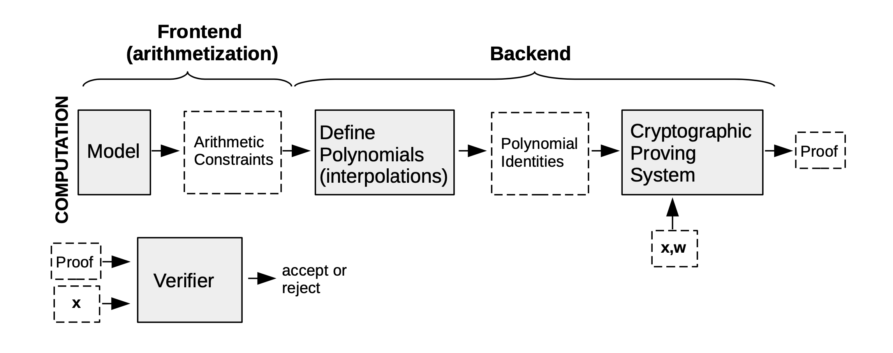
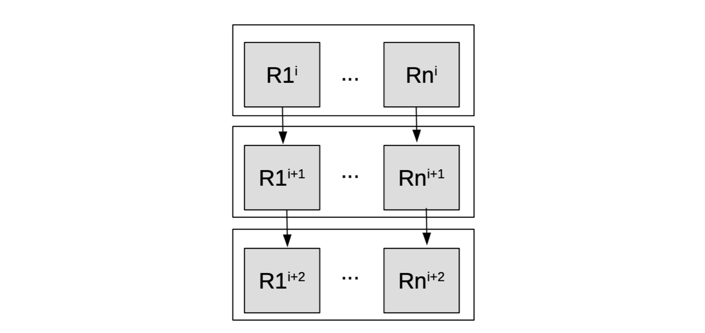
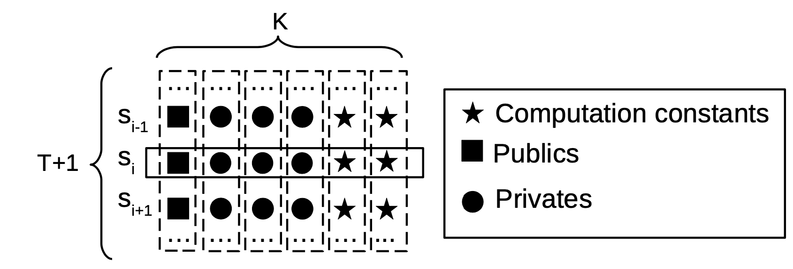

The overall design of the Polygon zkEVM follows the state machine model, and thus emulates the Ethereum Virtual Machine (EVM), with the aim to provide the same user experience as in Ethereum. In addition to enabling payments and transfers of ERC20 tokens, users can now run Ethereum smart contracts on it.

The rollup strategy is to develop a zkProver that takes a batch of many transactions, proves their validity, and only publishes a minimally-sized validity proof for verification. This helps to reduce transaction finality time and saves gas costs for Ethereum users. 

However, the zkEVM is not just a rollup but a zero-knowledge rollup. Its design takes advantage of the best known techniques in the ZK folklore, while introducing novel ZK tools. For instance, the Polynomial Identity Language (PIL), which is pivotal in enabling the zkProver produce verifiable proofs.

The **state machine model** is best suited for iterative deterministic computations, which are a common place in the Ethereum blockchain. This model is preferred over the arithmetic circuit model, which would need loops to be unrolled, and hence resulting in undesirably larger circuits.

### The Basic Design Approach

The general approach to designing the zkProver so as to realise a proof system based on state machines is as follows,

- Firstly, turn the required deterministic computation into a **state machine** computation.

- Secondly, describe state transitions in terms of **algebraic constraints**. These are like rules that every state transition must satisfy.

- Thirdly, use **interpolation** of state values to build polynomials that describe the state machine.

- Fourthly, define **polynomial identities** that all state values must satisfy.

- Fifthly, a specially designed **cryptographic proving system** (e.g. a STARK, a SNARK, or a combination of the two) is used to produce a verifiable proof, which anyone can verify.

The first four steps are commonly referred to as **Arithmetization**. An arithmetization can be seen, in the case of STARKs, as the Algebraic Intermediate Representation (AIR), while in the case of SNARKs (which use arithmetic circuits) it can be seen as the R1CS system.

Also, since the context of the zkProver's deployment is that of a public-key cryptographic system, a commitment scheme is required. In particular, the underpinnings of the zkProver's capability to prove correctness of computations and allow any independent party verify the validity proofs is a **polynomial commitment scheme**.

<b> Figure 1 : General Approach to the zkProver's Design </b>

## State Machine Basics

A state machine is composed of registries that carry numerical values. These values are often called, **registry values**. At a given point in time, registry values constitute what is called a **state** of the state machine.

A **state machine** is so called, because it is a machine whose behaviour is described in terms of its states and the rules that determine how one state transitions to another.

Hence, the next concept pertinent to state machines, and arithmetization of computations, is that of a **clock**. A state transition in a state machine occurs at each tick of the **clock**. A clock thus controls registries of a state machine, determining the timing and order of execution.

A computation is **deterministic** if, given a particular input, it will always produce the same output. This type of computations are consequently verifiable. The zkProver executes these deterministic computations in order to produce verifiable proofs of correctness.

There are three types of values required to enable verifiability of these proofs;

(a) **Computation constants**, which are constants specifically related to the computation being carried out.

(b) **Publics**, $\mathbf{x}$, which are variables; values that can be changed to generate different proofs for the same computation, but are public since they are known by both the prover and the verifier.

(c) **Privates**, $\large{\mathtt{w}}$, which are private values, also known as (a.k.a) ”the witness”. These values are only known by the prover.

<b> Figure 2: Simplified State Machine in terms of indexed registries </b>

The **execution trace** of a state machine is the record of all its registry values, commonly represented in table form, where the rows represent the states, and the columns depict its distinct variables (or polynomials). Each column records the values of a particular registry across time, while each row represents the state of the entire machine at a given point in time.

Each state machine has **initial state values**. Figure 3 below depicts the execution trace of a state machine with $\mathtt{K}$ variables and $\mathtt{T+1}$ states, where typically, $\mathtt{T+1}$ is some power of $2$. After reaching the ($\mathtt{T + 1}$)-th row the state machine gets initialized to the initial state. It loops back to its initial state, hence achieving cyclicity required for iterative computations. Generally, every state machine has a **cycle** of length $\mathtt{2^t}$ for some integer $\mathtt{t}$.

<b> Figure 3: Computation Trace of a State Machine </b>

**Arithmetic constraints** are used to enforce correctness of the computation. These constraints are referred to as *arithmetic* because they are equations containing arithmetic operations such as addition or multiplication. They define how values of a particular state and its previous state are related.

The process of efficiently proving a computation involves interpolating certain values into polynomials, and subsequently forming polynomial equations, a.k.a. **polynomial identities**.

