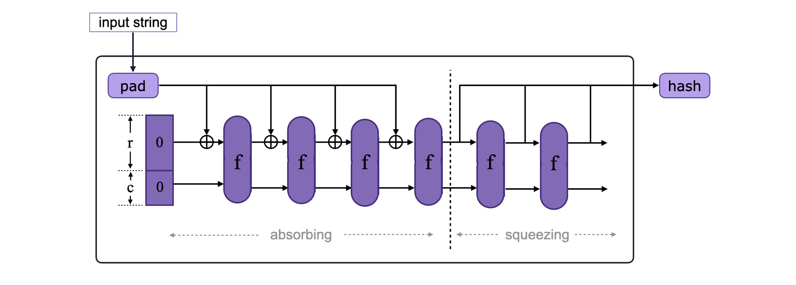

# Hashing State Machines

The zkEVM utilises two state machines for hashing purposes; The Keccak State Machine and the $\text{POSEIDON}$ State Machine. The Keccak-256 hash function is used for seamless compatibility with the EVM, while [$\text{POSEIDON}$](https://eprint.iacr.org/2019/458.pdf) is most suitable for the zkProver context because it is a [STARK-friendly](https://starkware.co/hash-challenge/) hash function.

Keccak and $\text{POSEIDON}$ are both sponge constructions by design.

## The Sponge Construction

A generic **sponge construction** is a simple iterated construction for building a function 
$$
F: \mathbb{Z}^* \to \mathbb{Z}^l
$$

with an input of variable-length and arbitrary output length based on a fixed-length permutation
$$
f: \mathbb{Z}^b \to \mathbb{Z}^b
$$

operating on a fixed number $b$ of bits.

The array of $b$ bits that $f$ keeps transforming is called the **state**, and $b$ is called the **width** of the state.

The state array is split into two chunks, one with $r$ bits and the other with $c$ bits. So that the width $b = r + c$  where $r$ is called the **bitrate** (or simply **rate**) and $c$ is called the **capacity**.

The sponge construction can also be described in terms of phases;

- The *Init Phase*: In this phase the input string is either padded to reach the $r$-bit length (if the input string was shorter than $r$ bits), or it is split into $r$-bit long chunks with the last one being padded to reach the $r$-bit length (if the input string was longer than $r$ bits). A reversible **padding rule**, specific to a hash function, is applied.

  The hash function's state is initialised to a $b$-bit vector (or array) of zeros.

- The *Absorbing Phase*: In this phase, the $r$-bit input blocks are XORed sequentially with the first $r$ bits of the state, interleaved with applications of the permutation function $f$. This continues until all input blocks have been XORed with the state. 

  Observe that the last $c$ bits corresponding to the capacity value does not absorb any input from the outside. 

- The *Squeezing Phase*: In this phase, the first $r$ bits of the state are returned as output blocks, interleaved with applications of the function $f$. The number of output blocks is chosen at will by the user. Observe that the last $c$ bits corresponding to the capacity value are never output during this phase. Actually, if the output exceeds the specified length, then it gets truncated to the required size.

A schema of the sponge construction is shown in the Figure below.

<b> Figure 1: A Sponge Function Construction </b>

The elements that completely describe a single instance of a sponge construction are: the fixed-length permutation $f$, the padding rule **pad**, the bitrate value $r$ and the capacity $c$.

