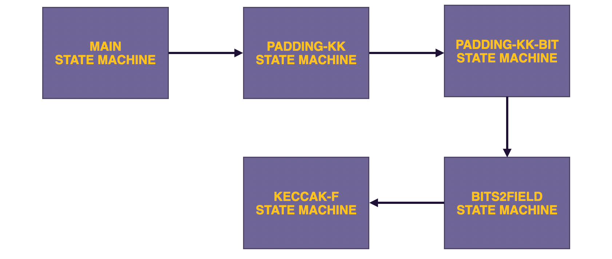

# Keccak Hashing Framework

The zkEVM, as a L2 zk-rollup for Ethereum, utilises the Keccak hash function in order to achieve seamless compatibility with the Layer 1, the Ethereum blockchain.

However, instead of implementing the Keccak-256 hash function as one state machine, the zkEVM does this in a framework consisting of four state machines. And these are;

1. The Padding-KK SM [sm_paddingkk.cpp](https://github.com/0xPolygonHermez/zkevm-prover/blob/main/src/sm/padding_kk/padding_kk_executor.cpp) is used for padding purposes, as well as validation of hash-related computations pertaining to the Main SM's queries.

2. The Padding-KK-Bit SM [sm_padding_kkbit.cpp](https://github.com/0xPolygonHermez/zkevm-prover/blob/main/src/sm/padding_kkbit/padding_kkbit_executor.cpp) converts between two string formats, the bytes of the Padding-KK SM to the bits of the Keccak-f Hashing SM, and vice-versa.

3. The Bits2Field SM, [sm_bits2field.cpp](https://github.com/0xPolygonHermez/zkevm-prover/blob/main/src/sm/bits2field/bits2field_executor.cpp), is used specifically for parallelizing implementation of the Keccak-f SM. It operates like a multiplexer of sorts between the Padding-KK-Bit SM and the Keccak-f SM. This state machine is named **Bits2Field** because it initially ensured correct packing of bits from $44$ different blocks of the Padding-KK-Bit SM into a single field element.

   Although the name "Bits2Field SM" has been retained in the Mango testnet release, the Bits2Field SM now packs bits from $44$ different blocks of the Padding-KK-Bit SM into a single field element. That is, it currently functions as a "$44$-bits-to-$1$-field-element" multiplexer.

4. The Keccak-f SM, [sm_keccakf.cpp](https://github.com/0xPolygonHermez/zkevm-prover/blob/main/src/sm/keccak_f/keccak_f_executor.cpp), computes hashes of strings at the request of the Main SM. Although the Keccak-f SM is a binary circuit, instead of executing on a bit-by-bit basis, it executes on a 44bits-by-44bits basis. This is tantamount to running $44$ hashing circuits in parallel.

As depicted in the below figure, the Padding-KK SM is the Main SM's gateway to the Keccak hashing state machines.

<b> Figure 1: Keccak State Machine Design Schema </b>

