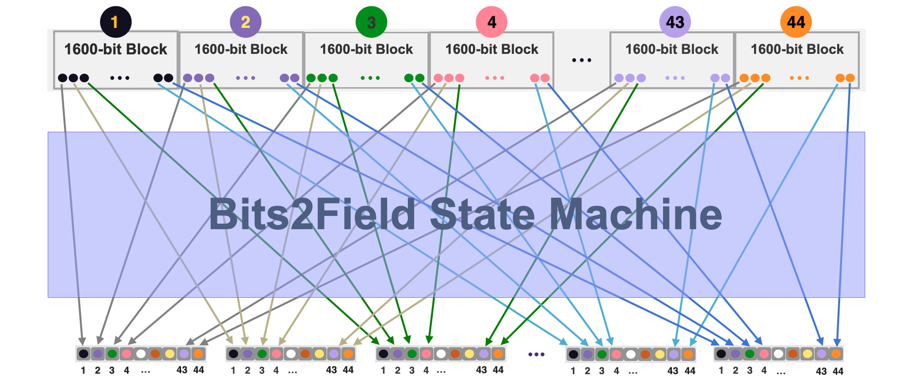

# Bits2Field State Machine

The Bits2Field State Machine, [sm_Bits2Field.cpp](https://github.com/0xPolygonHermez/zkevm-prover/blob/main/src/sm/bits2field/bits2field_executor.cpp), is one of the auxiliary state machines used specifically for parallelising implementation of the Keccak-f SM.


## A Multiplexing Machine

The state machine ensures correct packing of $\mathtt{44}$ bits from $\mathtt{44}$ different $\mathtt{1600}$-row blocks of the Padding-KK-Bit SM into a single field element.

It operates like a (44 bits to 1 field element) **multiplexer** between the Padding-KK-Bit SM and the Keccak-f SM. 

That is, it takes bits from $\mathtt{44}$ different blocks, places them into the first 44 bit-positions of a single field element, whereupon the Keccak-f circuit runs. 

The name $\texttt{Bits2Field}$ State Machine refers to the processing where $44$ **bits** from $44$ different blocks of the Padding-KK-Bit SM are inserted into a **single field element**.

Therefore, although the Keccak-f SM is a binary circuit, instead of executing on a bit-by-bit basis, it is implemented to execute Keccak-f operations on a $\mathtt{44}$bits-by-$\mathtt{44}$bits basis. This is tantamount to running $\mathtt{44}$ Keccak-f hashing circuits in parallel.

The Bits2Field SM's multiplexing aimed, at parallelising the Keccak-f circuit sketched, is outlined below. 




<div align="center"><b> Figure 1: The 44 bits to 1 field-element Multiplexing </b></div>


#### Mapping 44 Bits To A 64-bit Field Element

Suppose operations are carried out in a field $\mathbb{F}_p$ of $\mathtt{64}$-bit numbers. The smallest field used in the zkProver is the Goldilocks Field  $\mathbb{F}_p$  where $p = 2^{64} - 2^{32}+1$.

After multiplexing, the 44 bits are loaded into the first 44 least significant bit-positions of the field element as depicted in Figure 2 below.

A field element as an input to the Keccak-f circuit is of the form,
$$
\mathtt{0b}\mathtt{0000\ 0000\ 0000\ 0000\ 0000}\ \mathtt{X}_1 \mathtt{X}_2 \mathtt{X}_3 \mathtt{X}_4\ \mathtt{X}_5 \mathtt{X}_6 \mathtt{X}_7 \mathtt{X}_8\ \dots \mathtt{X}_{43} \mathtt{X}_{44}
\text{ }
$$
and it is composed of 20 zeroes and 44 meaningful bits related to the committed polynomials.

Given the capacity of $2^{23}$ in terms of the state machine evaluations (i.e., the degree of polynomials) and the Keccak-f's $\texttt{SlotSize} = 155286$, one obtains $ 2^{23} / 155286 = 54.020375307$ Keccak-f slots. Therefore, a total of $54$ slots $\times$ $44$ blocks $= 2376$ Keccak blocks can be processed. This is a big improvement from the previous $477$ blocks of the 9 bits to 1 field element multiplexing (i.e., $53 \times 9 = 477$.)


<div align="center"><b> Figure 2: How 44 Bits are mapped to a 64-bit field element </b></div>


### The Bits2Field PIL Code

The Bits2Field executor, [sm_Bits2Field.cpp](https://github.com/0xPolygonHermez/zkevm-prover/blob/main/src/sm/bits2field/bits2field_executor.cpp), executes the multiplexing of forty-four $\mathtt{1600}$-bit blocks into $\mathtt{1600}$ field elements, where each is a $\mathtt{N}$-bit field element. See Figure 2 above, where $\mathtt{N = 64}$.

The question here is how to identify each of the original nine bits of the field element, so as to track their corresponding resultant $\mathtt{XOR}$ values or $\mathtt{ANDP}$ values? 

Note that every bit $\mathtt{b_{i,j}}$ from the $\mathtt{i}$-th $\mathtt{1600}$-bit block is placed at the $\mathtt{2^{i}}$-th position of the $\mathtt{N}$-bit field element.

The PIL code therefore uses factors denoted by $\mathtt{Factor}$, such that $\mathtt{Factor \in \{ 1, 2, 4, \dots , 2^{43} \}}$, and a $\mathtt{Fieldlatch}$ after running through forty-four $\mathtt{1600}$-bit blocks.

Suppose $\mathtt{N = 64}$. Then the 44 least significant bits of the $\mathtt{64}$-bit field element looks like this:

$$
\mathtt{field44 = X_1 \cdot 2^{43} + X_{2}*{2}^{42} + X_{2}*{2}^{41} + \dots + X_{42}*{2}^2 + X_{43}*2 + X_{44}}.
$$

The constraint checked is therefore,

$$
\mathtt{field44' = (1-Fieldlatch)*field44 + bit*Factor}
$$

The accumulated field element at the end of the execution (every forty-fourth row of the execution trace) is checked against the Keccak-f input $\mathtt{KeccakF.a}$ with the boundary constraint,

$$
\mathtt{Fieldlatch*(field44 - KeccakF.a) = 0}
$$

The [PIL code](https://github.com/0xPolygonHermez/zkevm-proverjs/blob/develop/pil/bits2field.pil) is given below.

<div align="center"><b> The Bits2Field PIL Code </b></div>

```pil
include "keccakf.pil";

namespace Bits2Field(%N);
    pol constant FieldLatch;  // [0:44,1]
    pol constant Factor;  // 1,2,4,8,...,2**43

    pol commit bit;
    pol commit field44;

    field44' = (1-FieldLatch)*field44 + bit*Factor;
    bit *(1-bit) = 0;

    FieldLatch*(field44 - KeccakF.a44) = 0;
```


